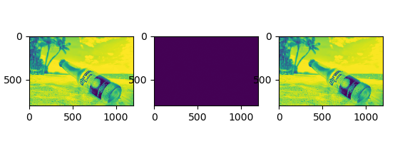
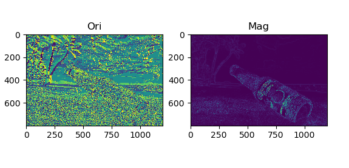
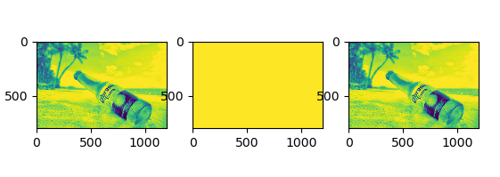
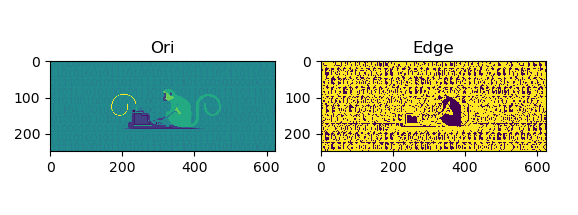
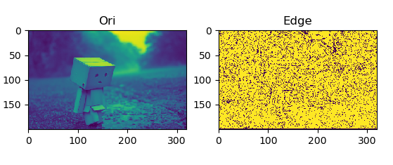
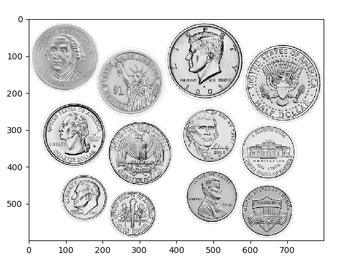
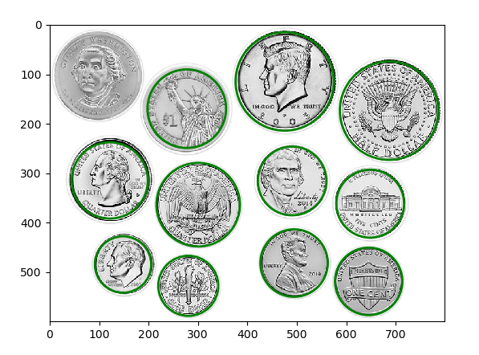

# Ex2: Convolution & Edge Detection

This repository contains the implementation of the exercises for the Convolution & Edge Detection assignment.

### Table of Content
* [About The Project](#About-The-Project)
* [Contents](#Contents)
* [Requirements](#Requirements)
* [Usage](#Usage)
* [Screenshots](#Screenshots)
---
## Exercise Details

- Exercise: Convolution & Edge Detection
- Due date: 28.4.2022
---
## About The Project

The purpose of this exercise is to understand the 
concept of convolution and edge detection by performing 
simple manipulations on images. The exercise covers the following 
topics:

- Implementing convolution on 1D and 2D arrays
- Performing image derivative and image blurring
- Edge detection
- Hough Circles
- Bilateral filter
---
## Contents

The assignment consists of the following parts:

1. **Convolution** 
   - Implementation of convolution for 1D and 2D signals.
   - Functions:
     - `conv1D(in_signal: np.ndarray, k_size: np.ndarray) -> np.ndarray`: Convolve a 1-D array with a given kernel.
     - `conv2D(in_image: np.ndarray, kernel: np.ndarray) -> np.ndarray`: Convolve a 2-D array with a given kernel.
 
 
2. **Image derivatives & blurring** 
 
   2.1 **Derivatives** 
   - Calculation of image gradient magnitude and direction using simple convolution.
   - Function:
     - `convDerivative(in_image: np.ndarray) -> (np.ndarray, np.ndarray)`: Calculate the gradient of an image.
 

   2.2 **Blurring** 
   - Implementation of image blurring using convolution with a Gaussian kernel.
   - Functions:
     - `blurImage1(in_image: np.ndarray, k_size: int) -> np.ndarray`: Blur an image using a Gaussian kernel.
     - `blurImage2(in_image: np.ndarray, k_size: int) -> np.ndarray`: Blur an image using a Gaussian kernel using OpenCV built-in functions.
 

3. **Edge detection** 
   - Implementation of edge detection algorithms.
   - Functions:
     - `edgeDetectionZeroCrossingSimple(img: np.ndarray) -> np.ndarray`: Detect edges using the "ZeroCrossing" method.
     - `edgeDetectionZeroCrossingLOG(img: np.ndarray) -> np.ndarray`: Detect edges using the "ZeroCrossingLOG" method.
 

4. **Hough Circles** 
   - Implementation of the Hough circles transform.
   - Function:
     - `houghCircle(img: np.ndarray, min_radius: int, max_radius: int) -> list`: Find circles in an image using a Hough Transform algorithm extension.
 

5. **Bilateral filter** 
   - Implementation of the Bilateral filter.
   - Function:
     - `bilateral_filter_implement(in_image: np.ndarray, k_size: int, sigma_color: float, sigma_space: float) -> (np.ndarray, np.ndarray)`: Apply the bilateral filter to an input image.
---
## Requirements

The implementation requires the following dependencies:

- numpy
- OpenCV
---
## Usage

To run the code, follow these steps:

1. Install the required dependencies using the following command:
   - `pip install numpy opencv-python`
2. Clone the repository: 
   - `https://github.com/LeeadJ/Image_Processing_Course.git`
3. Navigate to the project directory:
   - `cd <project_directory>`
4. Run the desired exercise file.

## Screenshots
#### Convolution

- Left - Image resulting from convolving the input image with the given kernel using the `conv2D` function.
- Middle - Difference between the convolved images obtained from my `conv2D` function
and the `cv2.filter2D` function in OpenCV.
- Right - The image resulting from convolving the input image with the same kernel using `cv2.filter2D` function in OpenCV.
---
#### Derivatives

- Left - Orientation of the gradient computed using my `convDerivative` function.
- Right - Magnitude of the gradient computed using my `convDerivative` function, multiplied by 255 to enhance visibility.
---
#### Blurring

- Left - The image after applying the blurring operation using `blurImage1` function. This represents the result of blurring the input image with a Gaussian kernel created using binomial coefficients.
- Middle - The difference between the images obtained from my blurImage1 and blurImage2 functions. This subplot shows the pixel-wise difference between the two blurred images.
- Right - The image after applying the blurring operation using the OpenCV filter2D function with a Gaussian kernel created using OpenCV's built-in function getGaussianKernel.
---
#### Edge Detection

- Left - The original grayscale image. This is the input image on which the edge detection is performed.
- Right - The resulting edge matrix obtained from the "ZeroCrossing" edge detection method. The edge pixels will be highlighted as white (pixel value of 255) in the output image.
- The purpose of this plot is to visually compare the original image with the detected edges to observe the effect of the edge detection algorithm.

---
#### Hough Circles

- The original grayscale image along with the detected circles using two different methods:
    1. (Top) Circles detected using my implementation will be drawn in red.
    2. (Bottom) Circles detected using OpenCV's HoughCircles function will be drawn in green.
