# Ex3: Pyramids and Optic Flow

This repository contains the implementation of the exercises for the Pyramids and Optic Flow assignment.

### Table of Content
* [About The Project](#About-The-Project)
* [Contents](#Contents)
* [Requirements](#Requirements)
* [Usage](#Usage)
* [Screenshots](#Screenshots)
---
## Exercise Details

- Exercise: Pyramids and Optic Flow
- Due date: 13.06.2023
---
## About The Project

This project focuses on implementing various tasks related to pyramids and optic flow. 
It provides functions to create Gaussian and Laplacian pyramids, estimate optical flow using the 
Lucas-Kanade algorithm, perform image alignment and warping, and blend images using pyramid blending.
The project aims to explore concepts in image processing and computer vision, allowing for 
the analysis and manipulation of images at different levels of detail and the estimation of motion 
between consecutive frames.

---
## Contents

The project consists of several exercises:

1. **Lucas Kanade Optical Flow**: 
    - Implement the Lucas-Kanade algorithm to estimate the optical flow between two images.
    - Function:
      - `opticalFlow(im1: np.ndarray, im2: np.ndarray, step_size=10, win_size=5) -> (np.ndarray, np.ndarray)`: Calculates the optical flow between two input images `im1` and `im2` using the Lucas Kanade algorithm.
2. **Hierarchical Lucas Kanade Optical Flow**: 
    - Capture large movements by using a hierarchical approach to optical flow estimation.
    - Function:
      - `opticalFlowPyrLK(img1: np.ndarray, img2: np.ndarray, k: int, stepSize: int, winSize: int) -> np.ndarray`: calculates the hierarchical Lucas Kanade optical flow between two input images `img1` and `img2`.
3. **Image Alignment and Warping**: 
    - Find the parameters for aligning and warping two input images, using methods such as Lucas-Kanade and correlation.
    - Function:
      - `findTranslationLK(im1: np.ndarray, im2: np.ndarray) -> np.ndarray`: Estimates the translation parameters between two input images `im1` and `im2` using the Lucas-Kanade method. It returns an array of translation parameters.
      - `findRigidLK(im1: np.ndarray, im2: np.ndarray) -> np.ndarray`: Estimates the rigid transformation parameters (translation and rotation) between two input images `im1` and `im2` using the Lucas-Kanade method.
      - `findTranslationCorr(im1: np.ndarray, im2: np.ndarray) -> np.ndarray`: Estimates the translation parameters between two input images `im1` and `im2` using a correlation-based method.
      - `findRigidCorr(im1: np.ndarray, im2: np.ndarray) -> np.ndarray`: Estimates the translation parameters between two input images `im1` and `im2` using a correlation-based method.
      - `warpImages(im1: np.ndarray, im2: np.ndarray, T: np.ndarray) -> np.ndarray`: Warps im2 image according to the transformation matrix T, which maps each pixel in `im2` to its corresponding location in `im1`.
4. **Gaussian and Laplacian Pyramids**: 
    - Create Gaussian and Laplacian pyramids to represent images at different scales and levels of detail.
    - Functions:
      - `gaussianPyr(img: np.ndarray, levels: int = 4) -> List[np.ndarray]`: Generates a Gaussian pyramid for the given input image `img`. The pyramid consists of multiple levels, and it returns a list of images at different scales.
      - `laplacianReduce(img: np.ndarray, levels: int = 4) -> List[np.ndarray]`: Creates a Laplacian pyramid for the input image `img`. The pyramid contains multiple levels, and it returns a list of images representing the Laplacian at different scales.
      - `laplacianExpand(lap_pyr: List[np.ndarray]) -> np.ndarray`: Reconstructs the original image from a Laplacian pyramid represented by the list `lap_pyr`. It returns the restored image.
5. **Pyramid Blending**: 
    - Blend two images using the pyramid blending method.
    - Functions:
      - `pyrBlend(img_1: np.ndarray, img_2: np.ndarray, mask: np.ndarray, levels: int) -> (np.ndarray, np.ndarray)`: Blends two images, `img_1` and `img_2`, using the PyramidBlend method. The blending is performed based on the provided `mask` and the number of `levels` in the pyramid. It returns the naive blend and the final blended image.

1. **Convolution** 
   - Implementation of convolution for 1D and 2D signals.
   - Functions:
     - `conv1D(in_signal: np.ndarray, k_size: np.ndarray) -> np.ndarray`: Convolve a 1-D array with a given kernel.
     - `conv2D(in_image: np.ndarray, kernel: np.ndarray) -> np.ndarray`: Convolve a 2-D array with a given kernel.
 

---
## Requirements

The implementation requires the following dependencies:

- Python 3.x
- numpy
- OpenCV
---
## Usage

To run the code, follow these steps:

1. Install the required dependencies using the following command:
   - `pip install numpy opencv-python`
2. Clone the repository: 
   - `https://github.com/LeeadJ/Image_Processing_Course.git`
3. Navigate to the project directory:
   - `cd Ex3: Pyramids and Optic Flow`
4. Run the desired exercise file.

## Screenshots
#### Lucas Kanade (LK) optical flow algorithm
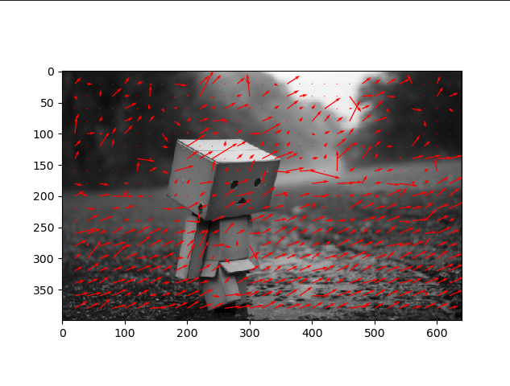
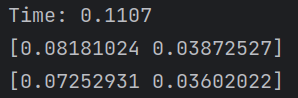
- Here we can see the second image (img_2) from the `opticalFlow` function with visualized optical flow vectors 
overlaid, showing the movement or displacement of key points between `img_1` and `img_2`.
- Below we can see:
  - Time taken to calculate the optical flow.
  - Median of the optical flow vectors, indicating the central tendency of the flow.
  - Mean of the optical flow vectors, representing the average flow.
---
#### Hierarchial Lucas Kanade Optical Flow

---

#### Comparing the two
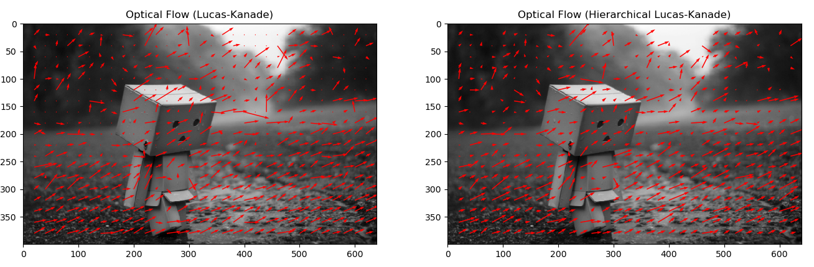

---

#### Comparing translation using Lucas-Kanade and Translation correlation
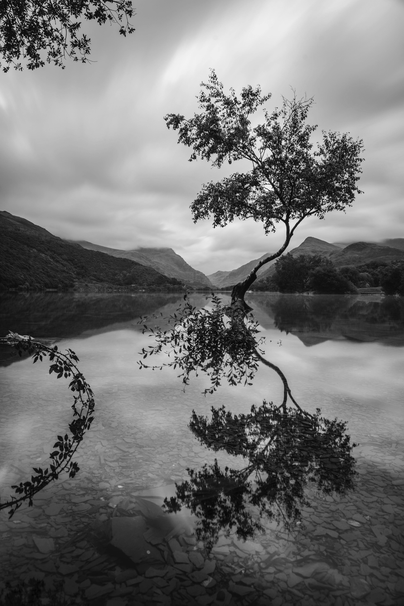
##### Translation using translation Matrix

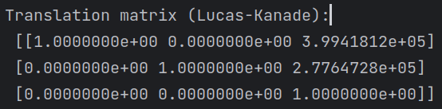
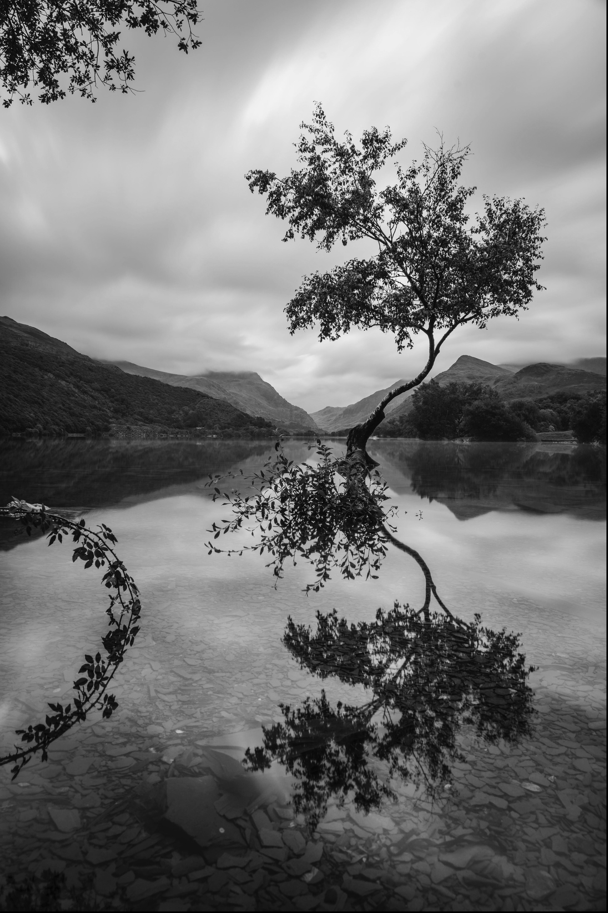
##### Translation using Lucas-Kanade

---
#### Translation Correlation
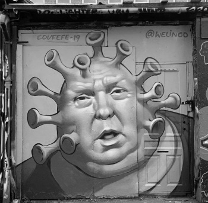
##### Original Image

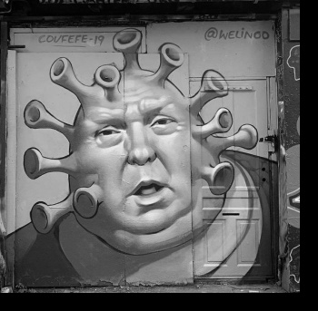
##### Applying translation matrix
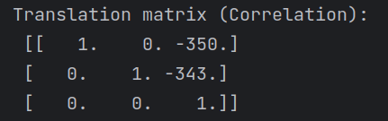

---

#### Rigid Transformation

##### Original Image

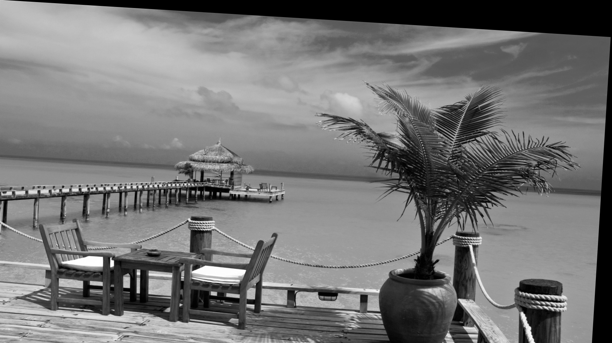
##### Applying rigid translation matrix
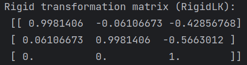

---

#### Rigid Correlation
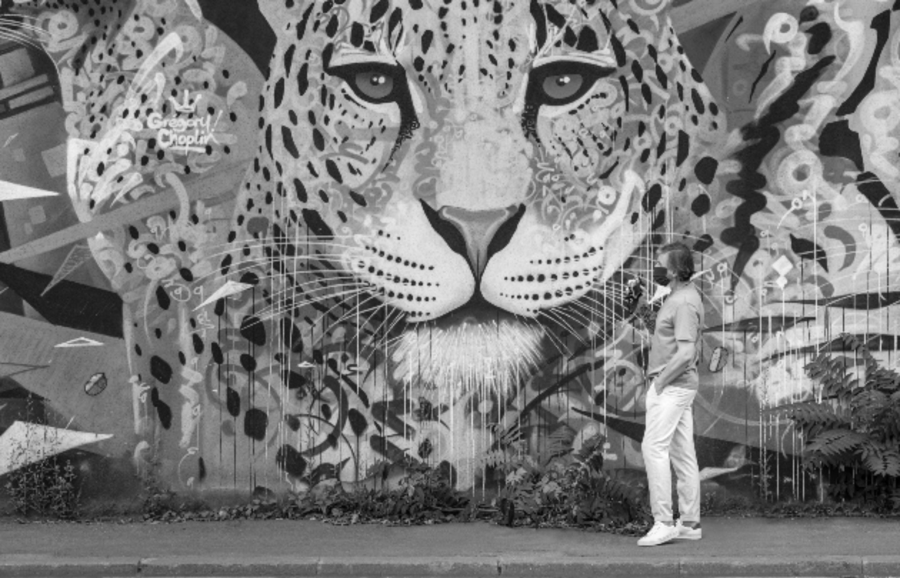
##### Original Image

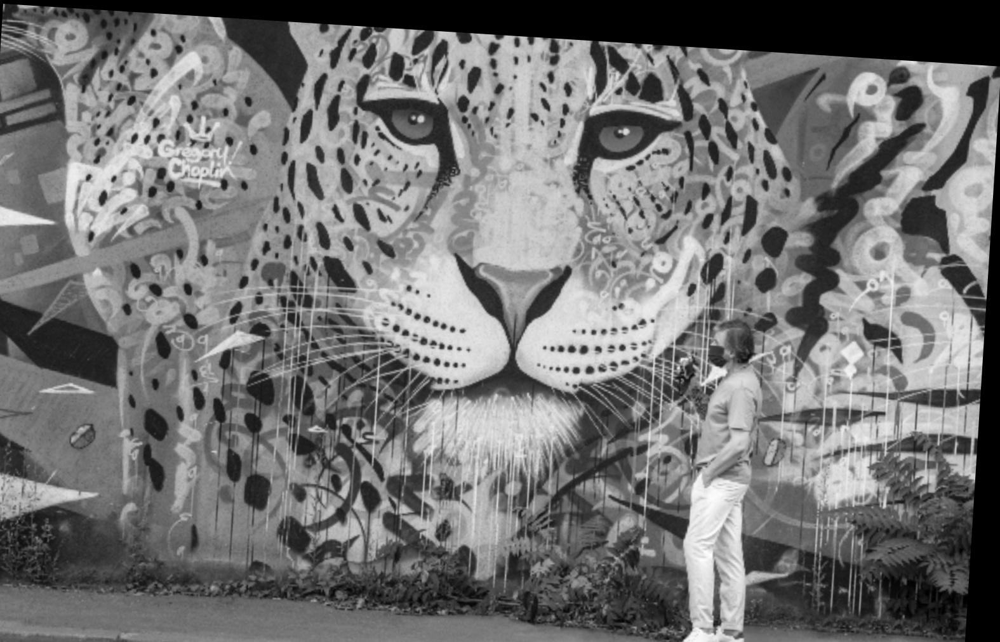
##### Applying rigid translation matrix
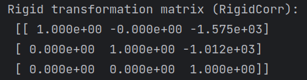

---
#### Image Warpping
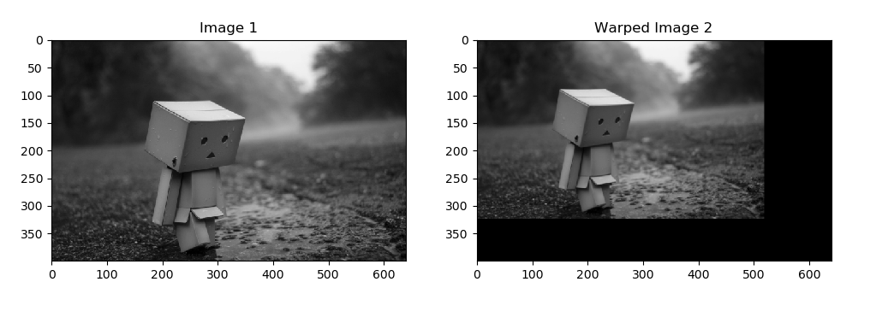
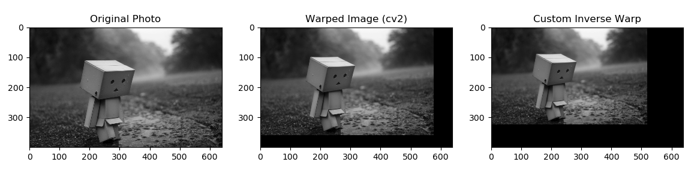

---
#### Gaussian Pyramid
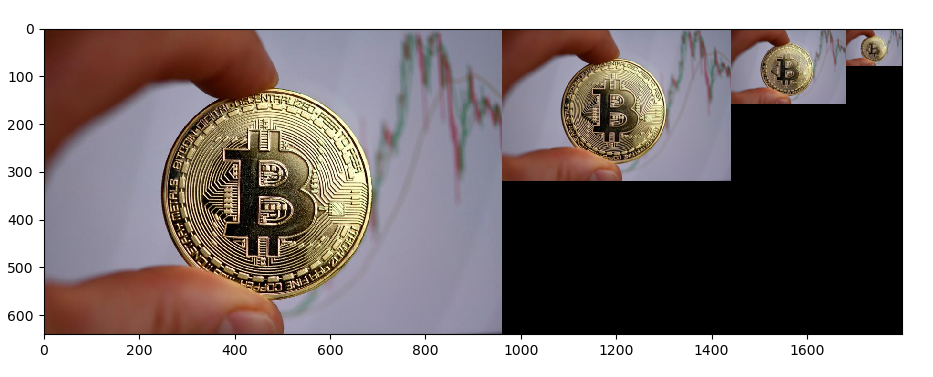

---
#### Pyramid Blending
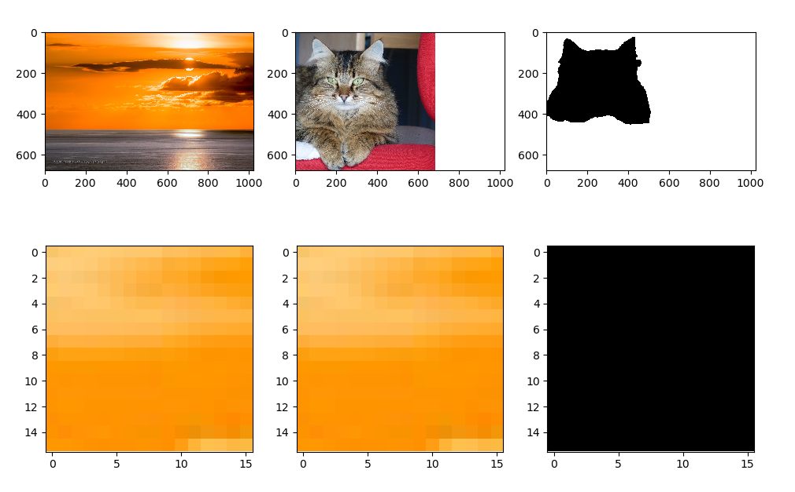
- This image displays a comparison of image blending using pyramid blending technique.

